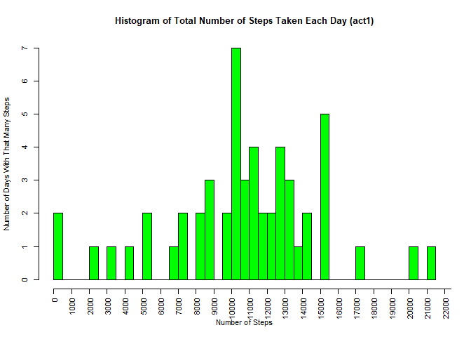
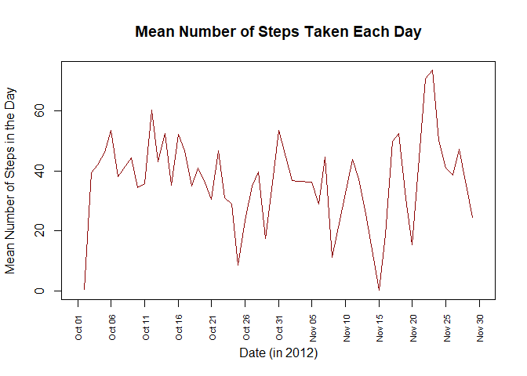
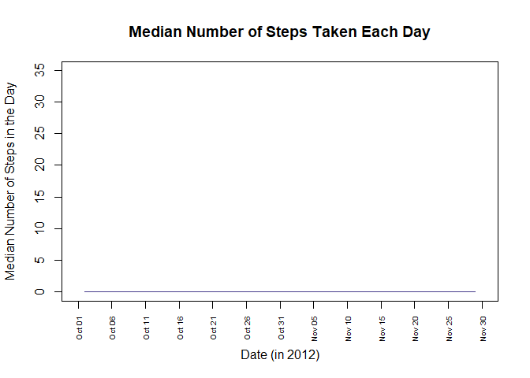
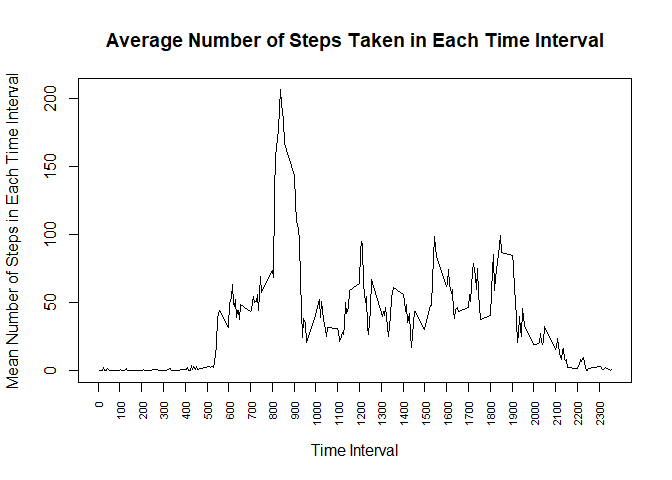
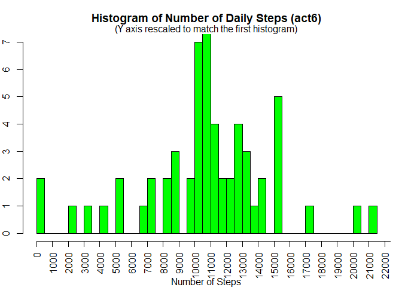
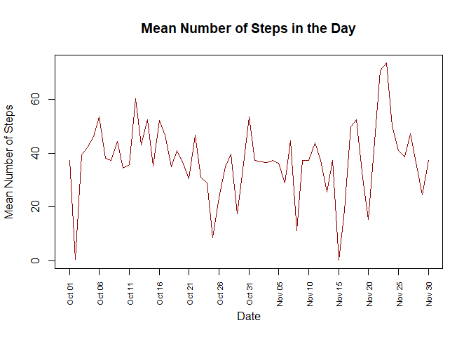
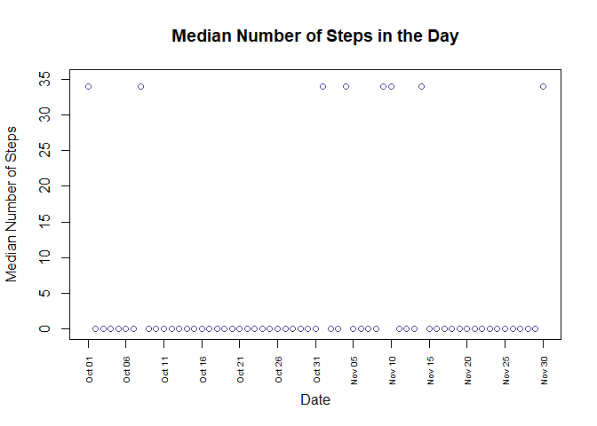
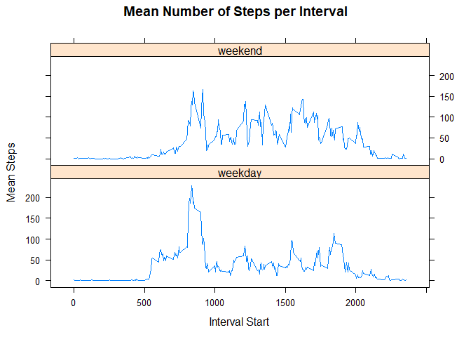

    fig.path='figure/'

Loading and preprocessing the data
----------------------------------

Show any code that is needed to  
1.) Load the data (i.e. read.csv())  
Note that setting the working directory may or may not be necessary
depending on your directory setup.

    #setwd("./Reproducible Research")

The code below includes a way to measure the time it took to read in the
data. You don't have to include the a,b, or b-a code in your file. It
makes no difference to anything that comes after. It's just interesting
to see.

    a <- Sys.time(); act <- read.csv("activity.csv", as.is = TRUE); b <- Sys.time(); b-a

    ## Time difference of 0.07635212 secs

2.) Process/transform the data (if necessary) into a format suitable for
your analysis  
\[I don't do anything here. All of the data processing is done within
the actual answers\]

What is the mean total number of steps taken per day?
-----------------------------------------------------

For this part of the assignment, you can ignore the missing values in
the dataset.  
1.) Calculate the total number of steps taken per day

    library(dplyr)
    library(lubridate)

    act1 <- 
            act %>%
            mutate(month = month(ymd(date))
                   , day = day(ymd(date))) %>%
            group_by(month, day) %>%
            summarise(sumSteps = sum(steps))
    act1

    ## # A tibble: 61 x 3
    ## # Groups:   month [2]
    ##    month   day sumSteps
    ##    <dbl> <int>    <int>
    ##  1    10     1       NA
    ##  2    10     2      126
    ##  3    10     3    11352
    ##  4    10     4    12116
    ##  5    10     5    13294
    ##  6    10     6    15420
    ##  7    10     7    11015
    ##  8    10     8       NA
    ##  9    10     9    12811
    ## 10    10    10     9900
    ## # ... with 51 more rows

2.) Make a histogram of the total number of steps taken each day

    par(cex = .7)
    hist(act1$sumSteps
         , col = "green"
         , main = "Histogram of Total Number of Steps Taken Each Day (act1)"
         , xlab = "Number of Steps"
         , ylab = "Number of Days With That Many Steps"
         , xaxt = "n"
         , breaks = 61
    )
    axis(side = 1
         , at = seq(from = 0, to = 25000, by = 1000)
         , las = 2)

3.) Calculate and report the mean and median of the total number of
steps taken per day

    act2 <- act %>%
            mutate(
                    year = year(ymd(date))
                    ,
                    month = month(ymd(date))
                    ,
                    day = day(ymd(date))
                    ,
                    monthDay = as.Date(paste(year(ymd(date)),"-", month,"-", day, sep = ""))
            ) %>%
            group_by(monthDay) %>%
            summarise(
                    meanSteps = mean(steps, na.rm = TRUE),
                    medianSteps = median(steps, na.rm = TRUE)
            )

This is the mean data

    a <- !is.na(act2$meanSteps)
    act2$meanSteps[a]

    ##  [1]  0.4375000 39.4166667 42.0694444 46.1597222 53.5416667 38.2465278
    ##  [7] 44.4826389 34.3750000 35.7777778 60.3541667 43.1458333 52.4236111
    ## [13] 35.2048611 52.3750000 46.7083333 34.9166667 41.0729167 36.0937500
    ## [19] 30.6284722 46.7361111 30.9652778 29.0104167  8.6527778 23.5347222
    ## [25] 35.1354167 39.7847222 17.4236111 34.0937500 53.5208333 36.8055556
    ## [31] 36.7048611 36.2465278 28.9375000 44.7326389 11.1770833 43.7777778
    ## [37] 37.3784722 25.4722222  0.1423611 18.8923611 49.7881944 52.4652778
    ## [43] 30.6979167 15.5277778 44.3993056 70.9270833 73.5902778 50.2708333
    ## [49] 41.0902778 38.7569444 47.3819444 35.3576389 24.4687500

3.) continued - For an over-time graph this is best displayed in a
lineplot

    plot(x = act2$monthDay[a]
         ,y = act2$meanSteps[a]
         ,type = "l"
         , col = "darkred"
         , ylab = "Mean Number of Steps in the Day"
         , xlab = "Date (in 2012)"
         , main = "Mean Number of Steps Taken Each Day" 
         , xaxt = "n"
         , xlim = c(as.Date("2012-10-01"), as.Date("2012-11-30"))
    )
    axis(side = 1, at = act2$monthDay[seq(from = 1, to = 61, by = 5)], format(act2$monthDay[seq(from = 1, to = 61, by = 5)], "%b %d"), las = 2, cex.axis = .7)

This is the median data

    act2$medianSteps[a]

    ##  [1] 0 0 0 0 0 0 0 0 0 0 0 0 0 0 0 0 0 0 0 0 0 0 0 0 0 0 0 0 0 0 0 0 0 0 0
    ## [36] 0 0 0 0 0 0 0 0 0 0 0 0 0 0 0 0 0 0

    plot(x = act2$monthDay[a]
         , y = act2$medianSteps[a]
         , type = "l"
         , col = "darkslateblue"
         , ylab = "Median Number of Steps in the Day"
         , xlab = "Date (in 2012)"
         , main = "Median Number of Steps Taken Each Day" 
         , xaxt = "n"
         , xlim = c(as.Date("2012-10-01"), as.Date("2012-11-30"))
         , ylim = c(-.1, 35)
    )
    axis(side = 1, at = act2$monthDay[seq(from = 1, to = 61, by = 5)], format(act2$monthDay[seq(from = 1, to = 61, by = 5)], "%b %d"), las = 2, cex.axis = 0.6)

What is the average daily activity pattern?
-------------------------------------------

1.) Make a time series plot (i.e. type = "l") of the 5-minute interval
(x-axis) and the average number of steps taken, averaged across all days
(y-axis).

    act3 <- act %>%
            group_by(interval) %>%
            summarise(
                    meanStepsTI = mean(steps, na.rm = TRUE)
            )
    act3

    ## # A tibble: 288 x 2
    ##    interval meanStepsTI
    ##       <int>       <dbl>
    ##  1        0      1.72  
    ##  2        5      0.340 
    ##  3       10      0.132 
    ##  4       15      0.151 
    ##  5       20      0.0755
    ##  6       25      2.09  
    ##  7       30      0.528 
    ##  8       35      0.868 
    ##  9       40      0     
    ## 10       45      1.47  
    ## # ... with 278 more rows

    plot(x = act3$interval[a]
         ,y = act3$meanStepsTI[a]
         ,type = "l"
         , col = "black"
         , ylab = "Mean Number of Steps in Each Time Interval"
         , xlab = "Time Interval"
         , main = "Average Number of Steps Taken in Each Time Interval"
         , xaxt = "n"
         , xlim = c(min(act3$interval[a]), max(act3$interval[a]))
    )
    axis(side = 1, at = act3$interval[rep(c(T,F,F,F,F,F,F,F,F,F,F,F), 24)], las = 2, cex.axis = .7)

2.) Which 5-minute interval, on average across all the days in the
dataset, contains the maximum number of steps?

    maxMeanStepsTI <- max(y = act3$meanStepsTI[a])
    maxMeanStepsTI #206.1698
    maxStepsIntervalIndex <- which(act3$meanStepsTI == maxMeanStepsTI)
    maxStepsIntervalIndex

    act3$interval[maxStepsIntervalIndex]

    ## [1] 835

#### So the 835-840 interval has the greatest average number of steps across all the days.

Imputing missing values
-----------------------

Note that there are a number of days/intervals where there are missing
values (coded as NA). The presence of missing days may introduce bias
into some calculations or summaries of the data.

1.) Calculate and report the total number of missing values in the
dataset (i.e. \# total number of rows with NAs).

    sum(is.na(act$steps))

    ## [1] 2304

    sum(is.na(act$date))

    ## [1] 0

    sum(is.na(act$interval))

    ## [1] 0

There are 2304 missing values, and they are all in "steps". Note that
2304 = 8 days \* 288 intervals/day.

2.) Devise a strategy for filling in all of the missing values in the
dataset. The strategy does not need to be sophisticated. For example,
you could use the mean/median for that day, or the mean for that
5-minute interval, etc.

Personal note: I could use a simple mean here.  
*a.) Would a linear regression over each day make any sort of sense? It
might, but coding it is going to be a mite complicated.  
*b.) perhaps some sort of simple linear interpolation? But not all the
missing values are flanked by present values.  
*c.) Some days are missing data completely, so we can't use a daily
average.  
*d.) Perhaps the simplest (and most comprehensive) thing to do then is
to use the multi-day average for the specific interval.

3.) Create a new dataset that is equal to the original dataset but with
the missing data filled in.

    act5 <- act
    act4 <- act %>% filter(is.na(steps))
    dim(act4) #2304x3

    for (interv in act4$interval) {
            indexList <- grep(interv, act4$interval)
            act4$steps[indexList] <- act3$meanStepsTI[indexList[1]]
    }

We can check our work.

    head(act4)

    ##       steps       date interval
    ## 1 1.7169811 2012-10-01        0
    ## 2 0.3396226 2012-10-01        5
    ## 3 0.1320755 2012-10-01       10
    ## 4 0.1509434 2012-10-01       15
    ## 5 0.0754717 2012-10-01       20
    ## 6 2.0943396 2012-10-01       25

Great. Looks like we've got the new data. Now we just have to put it
into the main dataframe.

    for (i in 1:length(act$steps)) {
            if (is.na(act5$steps[i])) {
                    act5$steps[i] <- act4$steps[(i %% 288)+1]
            }
    }
    sum(is.na(act5$steps))

    ## [1] 0

Looks good.  
This means that there are no missing values in the steps column any
longer.

We can check our work -

    head(act5); 

    ##       steps       date interval
    ## 1 0.3396226 2012-10-01        0
    ## 2 0.1320755 2012-10-01        5
    ## 3 0.1509434 2012-10-01       10
    ## 4 0.0754717 2012-10-01       15
    ## 5 2.0943396 2012-10-01       20
    ## 6 0.5283019 2012-10-01       25

    head(act)

    ##   steps       date interval
    ## 1    NA 2012-10-01        0
    ## 2    NA 2012-10-01        5
    ## 3    NA 2012-10-01       10
    ## 4    NA 2012-10-01       15
    ## 5    NA 2012-10-01       20
    ## 6    NA 2012-10-01       25

Note that these show the same identifying columns and the NAs have been
replaced. That's good. That's what we wanted.

4.a.)Make a histogram of the total number of steps taken each day

    library(dplyr)
    library(lubridate)
    act6 <- act5 %>%
            mutate(
                    month = month(ymd(as.character(date)))
                    ,
                    day = day(ymd(date))
                    ,
                    year = year(ymd(date))
                    ,
                    yearMonthDay = as.Date(paste(year, "-", month, "-", day, sep = ""))
            ) %>%
            group_by(yearMonthDay) %>%
            summarise(
                    sumStepsTI = sum(steps),
                    meanStepsTI = mean(steps),
                    medianStepsTI = median(steps)
            )
    act6

    ## # A tibble: 61 x 4
    ##    yearMonthDay sumStepsTI meanStepsTI medianStepsTI
    ##    <date>            <dbl>       <dbl>         <dbl>
    ##  1 2012-10-01       10766.      37.4            34.1
    ##  2 2012-10-02         126        0.438           0  
    ##  3 2012-10-03       11352       39.4             0  
    ##  4 2012-10-04       12116       42.1             0  
    ##  5 2012-10-05       13294       46.2             0  
    ##  6 2012-10-06       15420       53.5             0  
    ##  7 2012-10-07       11015       38.2             0  
    ##  8 2012-10-08       10766.      37.4            34.1
    ##  9 2012-10-09       12811       44.5             0  
    ## 10 2012-10-10        9900       34.4             0  
    ## # ... with 51 more rows

    par(mar = c(4,2,3,1))
    hist(act6$sumStepsTI
         , col = "green"
         , main = "Histogram of Number of Daily Steps (act6)"
         , xlab = "Number of Steps"
         , ylab = "Number of Days With That Many Steps"
         , xaxt = "n"
         , breaks = 61
         , ylim = c(0,7)
    )
    mtext("(Y axis rescaled to match the first histogram)")
    axis(side = 1
         , at = seq(from = 0, to = 25000, by = 1000)
         , las = 2
    )

4.b.)Calculate and report the mean and median total number of steps
taken per day.  
This is the mean data

    act6$meanStepsTI

    ##  [1] 37.3825996  0.4375000 39.4166667 42.0694444 46.1597222 53.5416667
    ##  [7] 38.2465278 37.3825996 44.4826389 34.3750000 35.7777778 60.3541667
    ## [13] 43.1458333 52.4236111 35.2048611 52.3750000 46.7083333 34.9166667
    ## [19] 41.0729167 36.0937500 30.6284722 46.7361111 30.9652778 29.0104167
    ## [25]  8.6527778 23.5347222 35.1354167 39.7847222 17.4236111 34.0937500
    ## [31] 53.5208333 37.3825996 36.8055556 36.7048611 37.3825996 36.2465278
    ## [37] 28.9375000 44.7326389 11.1770833 37.3825996 37.3825996 43.7777778
    ## [43] 37.3784722 25.4722222 37.3825996  0.1423611 18.8923611 49.7881944
    ## [49] 52.4652778 30.6979167 15.5277778 44.3993056 70.9270833 73.5902778
    ## [55] 50.2708333 41.0902778 38.7569444 47.3819444 35.3576389 24.4687500
    ## [61] 37.3825996

This is a graph of the mean data.

    plot(
            x = act6$yearMonthDay
            ,y = act6$meanStepsTI
            ,col = "darkred"
            ,type = "l"
            ,pch = floor(runif(1, 1, 26))
            ,ylab = "Mean Number of Steps"
            ,main = "Mean Number of Steps in the Day"
            ,xlab = "Date"
            ,xaxt = "n"
            ,xlim = c(as.Date("2012-10-01"), as.Date("2012-11-30"))
    )
    labels <- act6$yearMonthDay[seq(from = 1, to = 61, by = 5)]
    axis(side = 1, at = labels, format(labels, "%b %d"), las = 2, cex.axis = .7)

This is a graph of the median data.

    plot(
            x = act6$yearMonthDay
            ,y = act6$medianStepsTI
            ,col = "darkslateblue"
            ,ylab = "Median Number of Steps"
            ,main = "Median Number of Steps in the Day"
            ,xlab = "Date"
            ,xaxt = "n"
            ,xlim = c(as.Date("2012-10-01"), as.Date("2012-11-30"))
            ,ylim = c(-.1, 35)
    )
    axis(side = 1, at = labels, format(labels, "%b %d"), las = 2, cex.axis = 0.6)

Do these values differ from the estimates from the first part of the
assignment?  
*-Histogram is mostly the same except for a jump in the 10500-11000.  
*-Median graph just shows some non-zero values.  
-Mean graph shows very little change, but there is some.

What is the impact of imputing missing data on the estimates of the
total daily number of steps?  
-It doesn't change much. We see a single large jump for the 10500-11000
interval and a few other minor increments in other bars.

Are there differences in activity patterns between weekdays and weekends?
-------------------------------------------------------------------------

1.) Create a new factor variable in the dataset with two levels -
"weekday" and "weekend" indicating whether a given date is a weekday or
weekend day.

    library(lubridate)
    is.weekend <- function(input) {
            input <- as.Date(input)
            if (wday(input) %in% c(1, 7)) {
                    return("weekend")
            } else {
                    return("weekday")
            }
    }
    table(sapply(act$date, is.weekend))

    ## 
    ## weekday weekend 
    ##   12960    4608

See that there are 12960 of weekday and 4608 of weekend.  
Note that 4608 = 8 weekends \* 2 days/weekend \* 288 intervals/day.

    act7 <- act5
    act7$WKND <- factor(sapply(act$date, is.weekend))

Make a panel plot containing a time series plot (i.e. type = "l") of the
5-minute interval (x-axis) and the average number of steps taken,
averaged across all weekday days or weekend days (y-axis).

    act8 <- act7 %>%
            group_by(interval, WKND) %>%
            summarise(
                    meanStepsTI = mean(steps, na.rm = TRUE)
            )
    act8

    ## # A tibble: 576 x 3
    ## # Groups:   interval [288]
    ##    interval WKND    meanStepsTI
    ##       <int> <fct>         <dbl>
    ##  1        0 weekday     2.07   
    ##  2        0 weekend     0.0425 
    ##  3        5 weekday     0.418  
    ##  4        5 weekend     0.0165 
    ##  5       10 weekday     0.176  
    ##  6       10 weekend     0.0189 
    ##  7       15 weekday     0.188  
    ##  8       15 weekend     0.00943
    ##  9       20 weekday     0.368  
    ## 10       20 weekend     0.262  
    ## # ... with 566 more rows

    library(lattice)
    xyplot(act8$meanStepsTI ~ act8$interval |
                   WKND
           ,data = act8
           ,xlab = "Interval Start"
           ,ylab = "Mean Steps"
           ,type = "l"
           ,main = "Mean Number of Steps per Interval"
           ,layout = c(1,2))

